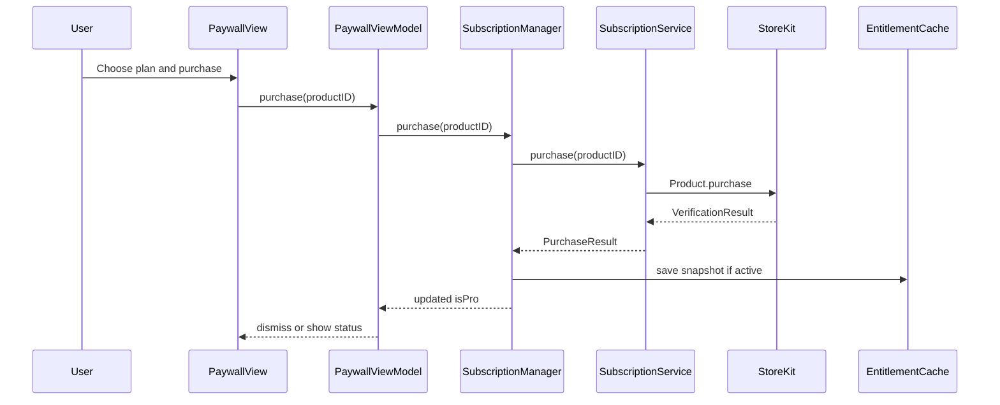
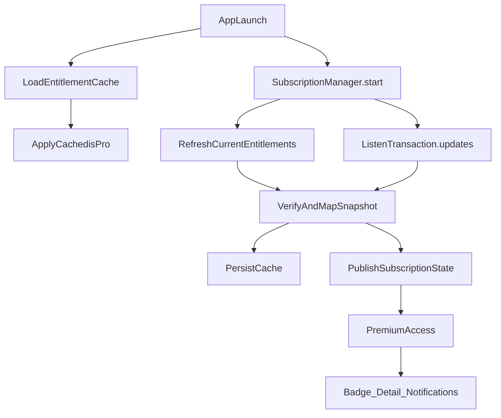
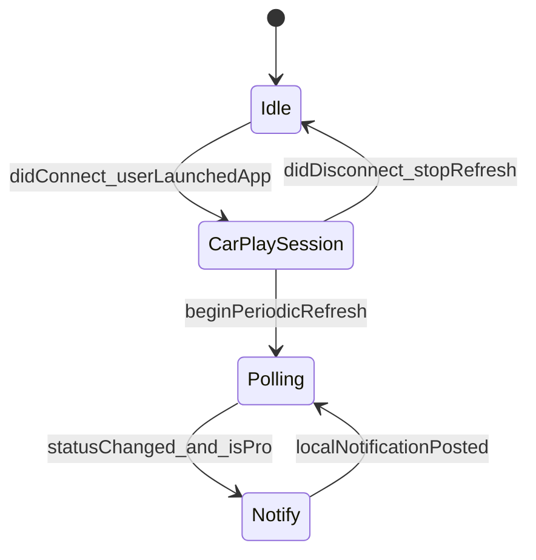

# StoreKit 2 Subscription — Feature Plan (Drive Check)

Status: **plan only** — no implementation in this branch yet.  
Audience: local agent / human implementing with iOS Engineering Runtime + project skills.  
Product: **Drive Check** (scheme/target `RegionalCheck`, bundle `vil4max.RegionalCheck`).

Related docs: [product-charter.md](product-charter.md), [architecture.md](architecture.md), [testflight-readiness.md](testflight-readiness.md), [analytics.md](analytics.md), [privacy-policy.html](privacy-policy.html).

---

## 1. Goal

Demonstrate **production-grade StoreKit 2** (portfolio / interviewer / TestFlight), not monetization.

Symbolic pricing; symbolic Pro entitlement. Core glanceable CarPlay experience stays free.

Success = a Senior iOS interviewer can install from TestFlight, purchase, restore, cancel, expire/relock, and review clean architecture.

---

## 2. Decisions (locked)

| Topic | Decision |
| --- | --- |
| Billing | Apple StoreKit 2 only — no RevenueCat / third-party SDKs |
| Concurrency | `async/await`, no Combine |
| UI | SwiftUI; Observation where it fits existing patterns |
| Architecture | Dedicated `Subscription/` module; MVVM at paywall edge; DI; StoreKit behind protocols |
| Product IDs | `regioncheck.pro.monthly`, `regioncheck.pro.yearly` |
| Prices (ASC / StoreKit config) | Monthly **$0.49**, Yearly **$4.99** (symbolic) |
| Free forever | Region check (iPhone + CarPlay) — never paywall-gated |
| Pro (Phase 1) | (A) Extended status detail + Pro badge + **in-session** local notifications on status change |
| Not in Phase 1 | History, favorites, export, AI, multi-region, background CarPlay monitor |
| Live Activity / Widget | Analyzed → **Phase 2 = Live Activity**; Widget deferred (see §8) |
| CarPlay auto-poll without app open | **Not feasible** for Driving Task — do not claim in UI/ASC (see §5) |
| Charter tension | Update charter note: Pro is a symbolic entitlement layer; notifications are session-scoped, not a monitor product |

---

## 3. Phase roadmap

### Phase 1 — StoreKit + symbolic Pro (this plan’s implementation target)

1. Subscription module (protocols, service, cache, manager).
2. StoreKit Configuration file + scheme wiring.
3. Paywall (native SwiftUI, App Review–compliant).
4. Entitlement gate: badge, extended detail, notification toggle/permission UX.
5. In-session Pro local notifications on `quiet ↔ alarm` (and clear policy copy).
6. Unit tests with mocked StoreKit boundary.
7. `README_Subscriptions.md` + ASC / Review / testing checklists.
8. Privacy/Terms links for subscriptions; ASC metadata notes.

### Phase 2 — Live Activity (future)

- Start Live Activity on CarPlay `didConnect` (and optionally iPhone “session”).
- Update on status change; end on `didDisconnect` / session end.
- Pro-gated: free users see paywall CTA, not Activity.
- Requires Widget Extension target + ActivityKit + App Group + signing.
- Still **does not** solve “CarPlay connected but Drive Check not launched”.

### Phase 3 — optional / probably skip

- Home Screen Widget (stale timeline; weak StoreKit story).
- Export snapshot, single region pin — only if portfolio needs more gates.
- Background monitoring — **out of product scope** (charter + Review).

---

## 4. Architecture (Phase 1)

### 4.1 Module layout (suggested)

```
RegionalCheck/
  Subscription/
    SubscriptionProductID.swift      // monthly / yearly constants
    SubscriptionProduct.swift        // display model (no StoreKit types in UI)
    SubscriptionState.swift          // loading / ready / purchasing / error + entitlement
    PurchaseResult.swift             // success | cancelled | pending | failed
    SubscriptionError.swift          // user-facing mapped errors
    PremiumFeature.swift             // extendedDetail, proBadge, statusChangeNotifications
    EntitlementSnapshot.swift        // verified productID, expiration, isActive, source
    SubscriptionServicing.swift      // protocol
    StoreKitSubscriptionService.swift
    EntitlementCaching.swift         // protocol
    EntitlementCache.swift           // offline-safe persistence
    SubscriptionRepository.swift     // optional thin persistence façade
    SubscriptionManaging.swift       // protocol for VM / UI
    SubscriptionManager.swift        // @MainActor @Observable orchestrator
    PremiumAccess.swift              // isPro / allows(PremiumFeature)
  Views/Subscription/
    PaywallView.swift
    PaywallViewModel.swift           // no import StoreKit
  Notifications/                     // or under Subscription/
    StatusChangeNotifier.swift       // protocol + UNUserNotificationCenter impl
```

Project uses `PBXFileSystemSynchronizedRootGroup` — new files under `RegionalCheck/` are picked up automatically (no manual pbxproj file list). Extension targets (Phase 2) **do** require project changes.

### 4.2 Dependency rules

```text
Views / PaywallViewModel  →  SubscriptionManaging / PremiumAccess
SubscriptionManager       →  SubscriptionServicing + EntitlementCaching
StoreKitSubscriptionService → StoreKit 2 only
StatusController / CarPlay → PremiumAccess + StatusChangeNotifier (no StoreKit)
```

- Views never talk to StoreKit.
- ViewModels contain no StoreKit types.
- Entitlement is derived from **verified** transactions (+ offline cache with expiry), never a manual “unlock” flag alone.
- Prefer injecting `SubscriptionManager` via `AppDependencies` (evolve static bag carefully; avoid new singletons beyond existing pattern).

### 4.3 Flow diagrams

**Purchase**



**Entitlement + Transaction.updates**



**CarPlay session + Pro notify (honest scope)**



---

## 5. CarPlay + notifications — feasibility (resolved)

### Desired but not supported

“CarPlay hardware connected, Drive Check **not** open on head unit → auto-start polling → notify.”

For **Driving Task** template apps:

- Scene connects when the user **launches** the app in CarPlay, not merely when CarPlay attaches.
- On leave/disconnect, current code stops refresh (`CarPlaySceneDelegate.handleDisconnect`).
- No reliable public API to treat “CarPlay connected” as a background execution grant for this category.
- Background fetch / Always location / server push would be a different product (monitor) and conflict with charter + Review positioning.

### Supported (Phase 1)

While **Drive Check CarPlay scene is connected** (iPhone UI may be backgrounded):

- Existing 5-minute polling continues.
- On verified phase change `quiet ↔ alarm` (optionally ignore `.idle` / `.error` flapping), if `isPro` and user granted notification permission → post a **local** notification.

Copy must say something like: notifications while Drive Check is active on CarPlay or open on iPhone — **not** 24/7 monitoring.

### Implementation hooks

- Observe `StatusController.state` (or a small `StatusChangeNotifier` fed from status updates) on MainActor.
- Request authorization only from Pro paywall / Pro settings (not on first cold launch).
- Dedupe: same phase + region within a short window → no spam.
- Respect Pro relock: if entitlement expires, stop notifying without restarting the app (manager publishes `isPro == false`).

---

## 6. Premium feature spec (Phase 1)

| Feature | Free | Pro |
| --- | --- | --- |
| Region status (phone + CarPlay) | Yes | Yes |
| Pro badge (About / status chrome) | Hidden or locked affordance → paywall | Visible |
| Extended status detail | Basic title/explanation only | Extra line(s): e.g. data `source`, richer “updated” nuance from snapshot |
| Status-change local notifications | No (CTA to Pro) | Yes, in-session only |

Extended detail should use existing `AlertStatusSnapshot.source` / `checkedAt` where possible — avoid inventing fake telemetry.

---

## 7. Paywall & App Review

### Must include

- Benefits list (honest, session-scoped notify language)
- Monthly + yearly plans with **price and duration** from StoreKit `Product`
- Purchase CTA
- Restore Purchases
- Privacy Policy link
- Terms of Use link (create `docs/terms-of-use.html` if missing; host or stable HTTPS for ASC)
- Auto-renew explanation (Apple standard subscription disclosure)
- Manage Subscription (`manageSubscriptionsSheet` / App Store subscription management)

### Must avoid

- Dark patterns, fake discounts, hidden price, forced purchase before core status
- Claiming background / CarPlay-without-app alerts
- Unlocking Pro from a local bool without verification path

### Legal / privacy follow-ups

- Update [privacy-policy.html](privacy-policy.html): subscriptions via Apple; notification permission; no new third-party analytics.
- App Privacy labels: notifications if used; purchases via Apple.
- Review Notes: sandbox/TestFlight account steps; symbolic Pro features listed; restore path.

---

## 8. Live Activity vs Widget (analysis summary)

| | Live Activity (Phase 2) | Widget (defer) |
| --- | --- | --- |
| Fit | High — glance during drive session | Medium — last snapshot only |
| StoreKit story | Strong (Pro gate + lifecycle) | Weak / awkward |
| Needs | Extension + ActivityKit + App Group | Extension + App Group + timeline |
| Updates without push | Only while app/session can update | Often stale |
| Solves CarPlay-without-app? | No | No |

**Recommendation:** Phase 2 = Live Activity bound to same session as CarPlay `didConnect`/`didDisconnect`. Skip Widget unless explicitly needed later.

---

## 9. StoreKit edge cases (implement explicitly)

**Purchase:** success, user cancelled, pending, failed, verification failed.  
**Subscription:** expired, revoked, refunded, upgrade/downgrade (same group).  
**App:** first launch, reinstall, restore after reinstall, offline launch (cache), offline purchase attempt, network recovery, restart.  
**Runtime:** `Transaction.updates`, multiple updates, foreground refresh of entitlements.  
**Testing surfaces:** StoreKit Configuration, Sandbox, TestFlight.

Offline cache rules:

- On launch, show cached `isPro` only if `expirationDate > now` (or Apple’s renewal semantics reflected in last verified snapshot).
- Always re-validate when network/StoreKit available; revoked/expired → relock and clear or rewrite cache.

---

## 10. App Store Connect checklist (human)

- [ ] Subscription Group (e.g. “Drive Check Pro”)
- [ ] Products `regioncheck.pro.monthly` / `regioncheck.pro.yearly`
- [ ] Localization (EN minimum; align with app en/ru/uk if required)
- [ ] Pricing $0.49 / $4.99 (or local equivalents)
- [ ] Review screenshot / notes for subscription
- [ ] Privacy Policy URL + Terms URL
- [ ] Paid Apps Agreement / tax / banking current
- [ ] Metadata does not describe a background alert monitor
- [ ] Versioning: follow `AGENTS.md` (new marketing version → build **1**)

---

## 11. Testing checklist

### Local StoreKit Configuration

- [ ] Products load
- [ ] Purchase succeeds → Pro unlocks
- [ ] Restore works
- [ ] Expiration → relock
- [ ] Renewal (config speed-up) → stays Pro
- [ ] Cancelled purchase → friendly state, no unlock
- [ ] Notification permission + in-session status flip posts notify only when Pro

### Sandbox

- [ ] Sandbox Apple ID
- [ ] Purchase / restore
- [ ] Expiration / renew
- [ ] Upgrade monthly→yearly / downgrade behavior

### TestFlight

- [ ] Fresh install
- [ ] Purchase
- [ ] Reinstall + restore
- [ ] Offline launch with prior Pro cache
- [ ] CarPlay session: open app on head unit, flip status (or mock), Pro notify on phone

### App Review dry-run

- [ ] All legal links work
- [ ] Restore visible
- [ ] Prices/durations visible
- [ ] No placeholder copy
- [ ] Core status usable without purchase
- [ ] No crashes on paywall cancel

---

## 12. Documentation deliverables (when implementing)

| Artifact | Purpose |
| --- | --- |
| `README_Subscriptions.md` | Architecture, flows, ASC setup, testing, troubleshooting, interview talking points |
| This file | Planning decisions + phased roadmap |
| `docs/terms-of-use.html` | Terms for paywall / ASC |
| Charter touch | Narrow exception note for symbolic Pro + session notifications |
| `architecture.md` | Point to Subscription module when code lands |

---

## 13. Senior review risks (pre-implement)

| Risk | Mitigation |
| --- | --- |
| God `SubscriptionManager` | Keep service/cache/notifier separate; manager orchestrates only |
| StoreKit in ViewModels | Protocol boundary + tests on fakes |
| Trusting cache forever | Expiry + revalidate on `Transaction.updates` |
| Notify spam / error flapping | Only `quiet↔alarm`; debounce; Pro + auth gates |
| Over-claiming CarPlay background | Copy + Review Notes + no BG modes for monitoring |
| Charter conflict (“Never notifications”) | Document intentional symbolic Pro; session-scoped only |
| Phase 2 scope creep | Separate PR for ActivityKit extension |
| Linux CI / cloud agent | Implement/verify on Mac with `just verify` + XcodeBuildMCP |

---

## 14. Implementation order (local Mac)

1. `just doctor` / `just diagnose` per [agent-pilot-brief.md](agent-pilot-brief.md).
2. Add `Subscription/` types + protocols + fake service for tests.
3. `StoreKitSubscriptionService` + `EntitlementCache` + `SubscriptionManager.start()`.
4. Wire `AppDependencies` + paywall entry from About / Pro badge.
5. Gate extended detail + badge in `StatusView` / About.
6. `StatusChangeNotifier` hooked from status updates; CarPlay session already owns polling.
7. `Products.storekit` + scheme `StoreKitConfigurationFileReference`.
8. Localization strings (en/ru/uk) for paywall + notify.
9. Tests: entitlement mapping, cache expiry, purchase result mapping, feature gate.
10. Docs: `README_Subscriptions.md`, terms, charter/architecture notes.
11. `just verify` (note known pilot `#require` test issue if still present).
12. ASC products + TestFlight validation on device + CarPlay if available.

Ask before build/test/commit/push unless the human explicitly waived that for the local run.

---

## 15. Interview talking points (draft)

- Entitlement from verified transactions + `Transaction.updates`, not a UserDefaults “isPremium” write from the purchase button.
- Offline cache is a **performance/UX** layer with expiry, not source of truth.
- Protocol-oriented StoreKit boundary for unit tests without StoreKit Configuration in CI.
- CarPlay Driving Task lifecycle honestly scoped; no fake background monitor.
- Symbolic Pro chosen to keep constitution (one screen / one region) while proving commercial StoreKit quality.
- Phase 2 Live Activity extends the same session model rather than inventing a new product.

---

## 16. Open items for implementer (non-blocking)

1. Exact extended-detail copy (source string vs localized label).
2. Hosted HTTPS URLs for Privacy/Terms (GitHub Pages vs personal site).
3. Whether iPhone-only foreground session (without CarPlay) also enables Pro notifies — **recommend yes** for demo symmetry when `HomeView` / status polling is active.
4. Yearly vs monthly default selection on paywall (prefer yearly highlighted without fake “save XX%” unless mathematically true and disclosed).

---

## 17. Out of scope (explicit)

- Rewriting CarPlay UX or changing Ubilling provider.
- Accounts, backend receipt validation server, Offer Codes UI (can document later).
- RevenueCat / Superwall / Paywall vendors.
- Widget target in Phase 1.
- Claiming or implementing CarPlay-connected-but-app-closed polling.
